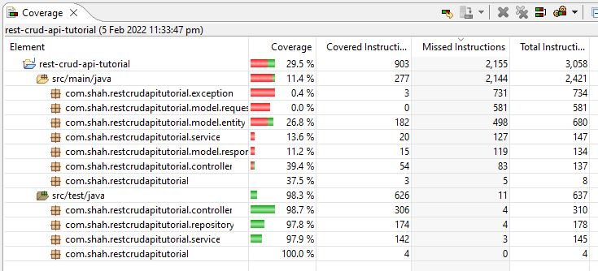

# BANKING APPLICATION - Spring Boot REST API tutorials documentation

## This is a simple REST API that does basic crud operations.

### Business features

<details>
<summary>Click to expand</summary><br>
  <ol>
    <li>Fetch all customers with pagination</li>
    <li>Get customer by account</li>
    <li>Search customers by field name, with pagination</li>
    <li>Create account for customers</li>
    <li>Update customers by account number</li>
    <li>Delete customer by account number</li>
    <li>Transfer credit from one acc number to another</li>
  </ol>

</details>

### Technical features

<details>
<summary>Click to expand</summary><br>
  <ol>
    <li>Customize json property<br>

The Jackson JSON toolkit contains a set of Java annotations which you can use to influence how JSON is read into objects, or what JSON is generated from the objects. Click [HERE](http://tutorials.jenkov.com/java-json/jackson-annotations.html) for more information.
<br>

  </li>
    <li>Creation timestamp<br>

Marks a property as the creation timestamp of the containing entity. The property value will be set to the current VM date exactly once when saving the owning entity for the first time.

```
    @CreationTimestamp
    private Date createdAt;
```

  </li>

  </ol>
</details>

### Useful resources

<details>
<summary>Click to expand</summary><br>
 
[How to map random fields](https://newbedev.com/spring-rest-partial-update-with-patch-method)  
[javax-validation](https://www.baeldung.com/javax-validation)  
[Retrieve validation message](https://stackoverflow.com/questions/2751603/how-to-get-error-text-in-controller-from-bindingresult)  
[Diff btwn javax.persistence & javax.validation and how to handle error from each validation](https://reflectoring.io/bean-validation-with-spring-boot/)  
[Create mock data](https://www.mockaroo.com/)  
[How to validate patch method using ValidatorFactory](https://stackoverflow.com/questions/56139024/how-to-automatically-add-bean-validation-when-partially-updating-patch-spring-bo)  
[Structuring Your Code](https://docs.spring.io/spring-boot/docs/current/reference/html/using.html#using.structuring-your-code)  
[If you have issue packaging to jar](https://stackoverflow.com/questions/35394885/lombok-not-compiling-in-maven)  

</details>

### For recap

<details>
<summary>Click to expand</summary><br>
 <ol>
  <li>Know that entity having camelCase will mapped into db into under_score eg: </li>

```
birthDate -> birth_date in Database
```

  <li>Arrange your order of json properties. Currently the id is at the bottom. we can bring this up by adding this at class level: </li>
 
```
@JsonPropertyOrder({"firstName","lastName"})
```
From this example, firstName will be at the most top followed by lastName
  <li>Hide json property. You can hide certain property of json. let us hide lastName by this annotation in entity:</li>

```
@JsonIgnore
private String lastName;
```

  <li> Rename json property. You can rename your json property name instead of using the default value based on variable name</li>

```
@JsonProperty("MyAwesomeFirstName")
private String firstName;
```

  <li>Use exception to throw validation error by means of try-catch</li>
  <li>Implement more fields in Employee to learn pagination</li>
   
  <li>In Repository, we dont need to test build-in methods of JPA. Only test your custom methods</li>

[(Explanation)](https://youtu.be/Geq60OVyBPg?t=2422)

 <li>Create native query</li>

[Click here](https://stackoverflow.com/questions/58453768/variables-in-spring-data-jpa-native-query)
  </ol>
</details>

### Unit Testing

<details>
<summary>Click to expand</summary><br>

<ul>
  <li>Introduction</li><br>

Unit test refers to the test of the most basic parts of an app -> A Unit. For REST application, we create test cases starting from Repository layer, then Service layer, then Controller where the test focus on integrating different layers of the application.

  <li>Code Coverage</li><br>

Code coverage describes the percentage of code covered by automated tests. in Eclipse we use [EclEmma](https://www.eclemma.org/) which is a free Java code coverage tool for Eclipse. Coverage is measured by percentage. Especially when working in enterprise, we must achieve atleast 50% total coverage



To achieve a high % coverage, we need to test elements that has highest number of instruction. Also, to cover your service class is highest priority.

  <li>Code quality</li><br>

[(SonarLint)](https://www.sonarlint.org/) is a Free and Open Source IDE extension that identifies and helps you fix quality and security issues as you code. Like a spell checker, SonarLint squiggles flaws and provides real-time feedback and clear remediation guidance to deliver clean code from the get-go.

</ul>

<br><br>

</details>

### Sample

<details>
<summary>Click to expand</summary><br>
  <ul>
    <li>Fetch all customers with pagination</li>
  </ul>
<br><br>
</details>

### Sample

<details>
<summary>Click to expand</summary><br>
  <ul>
    <li>Fetch all customers with pagination</li>
  </ul>
<br><br>
</details>

### Sample

<details>
<summary>Click to expand</summary><br>
  <ul>
    <li>Fetch all customers with pagination</li>
  </ul>
<br><br>
</details>