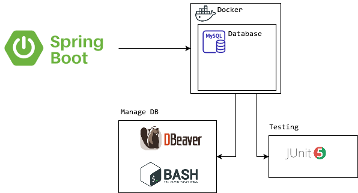

# BANKING APPLICATION - Spring Boot REST API tutorials documentation

## This is a simple REST API that does basic crud operations.

## Architecture Diagram



## Diagram flow

[](https://medium.com/java-vault/layered-architecture-b2f4ebe8d587)

### Business features

<details>
<summary>Click to expand</summary><br>
  <ol>
    <li>Fetch all customers with pagination</li>
    <li>Get customer by account</li>
    <li>Search customers by field name, with pagination</li>
    <li>Create account for customers</li>
    <li>Update customers by account number</li>
    <li>Delete customer by account number</li>
    <li>Transfer credit from one acc number to another</li>
  </ol>

</details>

### Technical features

<details>
<summary>Click to expand</summary><br>
  <ol>
    <li><b>Jackson Annotations</b><br></li>

The Jackson JSON toolkit contains a set of Java annotations which you can use to influence how JSON is read into
objects, or what JSON is generated from the objects.
Click [HERE](http://tutorials.jenkov.com/java-json/jackson-annotations.html) for more information.

  <li><b>Creation timestamp</b><br></li>

Marks a property as the creation timestamp of the containing entity. The property value will be set to the current VM
date exactly once when saving the owning entity for the first time.

```
@CreationTimestamp
private Date createdAt;
```

  <li><b>Update timestamp</b><br></li>

Marks a property as the update timestamp of the containing entity. The property value will be set to the current VM date
whenever the owning entity is updated

```
@UpdateTimestamp
private Date updatedAt;
```

  <li><b>Validations</b></li>

We assume that this is web-service where user can enter any field and value so a lot of validation is needed. Although
most of the time validation will be done in front-end.

  <li><b>Swagger Api</b><br></li>

An open source project used to generate the REST API documents for RESTful web services. It provides a user interface to
access our RESTful web services via the web browser.

We have one class for this config to do all the necessary configurations there.
Click [here](https://stackoverflow.com/questions/70043841/swagger-2-issue-spring-boot) for any issues faced. You can
access it in JSON-based or UI-based. These two have their default url. You can, of course customize this.

JSON-based

    http://localhost:9090/v2/api-docs

UI-based

    http://localhost:9090/swagger-ui.html

  <li><b>Scheduler</b><br></li>

Scheduling is a process of executing the tasks for the specific time period. Spring Boot provides a good support to
write a scheduler on the Spring applications. You can set the interval using cron or time units eg

```
@Scheduled(fixedDelay = 1000)
@Scheduled(fixedRate = 1000)
@Scheduled(fixedDelay = 1000, initialDelay = 1000)
@Scheduled(cron = "0 15 10 15 * ?")
@Scheduled(cron = "0 15 10 15 * ?", zone = "Europe/Paris")
```

Cron Expression

It is always an advantage to know what your cron expression value is by using CronParser library

    <!-- https://mvnrepository.com/artifact/net.redhogs.cronparser/cron-parser-spring -->
    <dependency>
          <groupId>net.redhogs.cronparser</groupId>
          <artifactId>cron-parser-spring</artifactId>
          <version>3.5</version>
    </dependency>

Not sure what expression to use? Click [here](https://www.freeformatter.com/cron-expression-generator-quartz.html) to
generate expression online

  <li><b>Initializer</b><br></li>

How to run logic at the startup of a Spring application? There many ways to achieve this:

1. @PostConstruct Annotation
2. _InitializingBean_ Interface
3. _ApplicationListener_
4. _@Bean initMethod_ Attribute
5. Constructor Injection
6. _CommandLineRunner_
7. _ApplicationRunner_
8. Combining any combination above

For simplicity we will demo using _CommandLineRunner_

Spring Boot provides a _CommandLineRunner_ interface with a callback _run()_ method. This method will be called after
the Spring application context is instantiated. [More info](https://www.baeldung.com/spring-boot-console-app)

  <li><b>Console appenders</b><br></li>

The console log can be customized to suit your preferences. we can customize the date format or what to display.

For quick setup, simply add this in your property:

    spring.main.banner-mode=off 
    spring.output.ansi.enabled=ALWAYS
    logging.pattern.console=%clr(%d{yy-MM-dd E HH:mm:ss.SSS}){blue} %clr(%-5p) %clr(${PID}){faint} %clr(---){faint} %clr([%8.15t]){cyan} %clr(%-40.40logger{0}){blue} %clr(:){red} %clr(%m){faint}%n

Default console display:

Customized console display:


[More info](https://howtodoinjava.com/spring-boot2/logging/console-logging-configuration/)
[More info](https://docs.spring.io/spring-boot/docs/current/reference/html/features.html#features.logging)

  <li><b>Spring boot custom banner</b><br></li>

Customize the default Spring Boot Banner. You can use images or plain text. To generate text,
use [ASCII Text Signature Generator](https://www.kammerl.de/ascii/AsciiSignature.php)

Configure your image-based banner [here](https://www.baeldung.com/spring-boot-custom-banners)

You can also color your text banner [here](https://www.baeldung.com/spring-boot-color-banner)

Result sample:


  </ol>
</details>

### How to start app on local

<details>
<summary>Click to expand</summary><br>

*We are using [MySql](https://www.mysql.com/)  as our DB, [Docker](https://www.docker.com/) to run
DB, [Dbeaver](https://dbeaver.io/) to manage DB, and [Postman](https://www.postman.com/) to run requests*

  <ul>
    <li><b>Setting up DB using Docker</b></li><br>

We will create DB without having to manually create from RDBMS by utilising Spring JPA. Our table will look something
like this:

[](https://ipwithease.com/three-tier-architecture-in-application/)

Install docker in your windows. Once done, create an instance of MySql Docker image by running this commands:

```
docker run --detach --env MYSQL_ROOT_PASSWORD=root --env MYSQL_DATABASE=mydb --env MYSQL_PASSWORD=root --env MYSQL_USER=admin --name localhost --publish 3306:3306 mysql:8.0

docker run --name postgres-tutorial -e POSTGRES_PASSWORD=password -d -p 5432:5432 postgres
```

Once this is done, make sure you have the SQL file in your resources folder so Spring Boot can read the values and
inserts into your DB when Spring Boot starts. So ensure this before starting your Spring Boot. Next we proced to verify
the DB. There are 2 methods for this

  <li><b>Verify database (using docker container)</b></li><br>

Once Spring starts, let's check our database (thru docker container) to verify if table is created and data added. Make
sure the parameters entered is consistent with the variables used during docker creation.

Run mysql in cli using docker

```
docker exec -it localhost bash
```

Connect to mysql

```
mysql -u admin -proot;
```

Test

```
use mydb;
show tables;
desc customer;
select * from customer;
```

Stop & remove all running proceses

```
docker rm $(docker ps -a -q) -f
```

 <li><b>Verify database (using Dbeaver)</b></li><br>

Download Dbeaver [here](https://dbeaver.io/download/). Open and create new database connection.

Database input field:

 ```
 mydb?allowPublicKeyRetrieval=true&useSSL=false&useLegacyDatetimeCode=false&serverTimezone=UTC
 ```

[](https://ipwithease.com/three-tier-architecture-in-application/)

<li><b>Run requests using Postman</b></li><br>

[View Postman collection](./src/main/resources/banking-rest-api-tutorials.postman_collection.json)

  </ul>
</details>

### Global exception - @ControllerAdvice

<details>
<summary>Click to expand</summary><br>
  <ul>
  <li><b>Intro</b></li>

During the software development process, it is inevitable to handle all kinds of exceptions. For me, at least half of
the time is spent dealing with all kinds of exceptions, so there will be a lot of try {...} catch {...} finally {...}
code blocks in the code, which not only has a lot of redundant code, but also affects the readability of the code.

  <li><b>So what is it?</b></li>

Spring consider exception handling a cross-cutting concern, thus it allows you to handle exceptions separately from the
rest of your code. This approach truly does work great with Spring!

Used for global error handling in the Spring MVC application. It also has full control over the body of the response and
the status code.

  <li><b>Types</b></li>

There are 2 types: <br>

  <ol>
  <li><b>Custom exception</b></li>

Where u throw yourself if it meets your condition and use GlobalExceptionHandler to
handle [HERE](https://stackoverflow.com/questions/67090406/throw-custom-exception-with-spring-data-rest)

  <li><b>Global exception</b></li>

Where it throws itself and u handle it using GlobalExceptionHandler

  </ol>

  <li><b>Benefits</b></li>

No cluttering of your code surrounding with try-catch blocks. This will result in cleaner and manageable code. You can
have more meaningful error message

</ul>
</details>

### Unit Testing

<details>
<summary>Click to expand</summary><br>

<ul>
  <li><b>Introduction</b></li><br>

Unit test refers to the test of the most basic parts of an app -> A Unit. For REST application, we create test cases
starting from Repository layer, then Service layer, then Controller where the test focus on integrating different layers
of the application.

  <li><b>Code Coverage</b></li><br>

Code coverage describes the percentage of code covered by automated tests. in Eclipse we
use [EclEmma](https://www.eclemma.org/) which is a free Java code coverage tool for Eclipse. Coverage is measured by
percentage. Especially when working in enterprise, we must achieve atleast 50% total coverage


To achieve a high % coverage, we need to test elements that has highest number of instruction. Also, to cover your
service class is highest priority.

  <li><b>Code quality</b></li><br>

[(SonarLint)](https://www.sonarlint.org/) is a Free and Open Source IDE extension that identifies and helps you fix
quality and security issues as you code. Like a spell checker, SonarLint squiggles flaws and provides real-time feedback
and clear remediation guidance to deliver clean code from the get-go.

  <li><b>Create test case</b></li><br>

If you are using IntelliJ, simply right-click on the repo file -> new -> Junit. This will automatically generate test
method. We will implement our test cases.

</ul>

</details>

### Unit Test - Repository

<details>
<summary>Click to expand</summary><br>

In Repository, we dont need to test build-in methods of JPA. Only test your custom methods. Since we dont have one, lets
create one (using @Query). This query will count number of country in employee table. The result will have custom
fields (using projection)

  <ul>
    <li><b>Diagram</b></li>

[](https://ipwithease.com/three-tier-architecture-in-application/)

 <li><b>H2 database</b></li><br>

To test repository, we can run the query against H2 database simply we dont want to store the data during testing. This
can be easily done by copy-paste our main application.properties into the test folder and change the db url from mysql
to h2. Schema and data will be loaded from the main resources

  </ul>
</details>

### Unit Test - Service layer

<details>
<summary>Click to expand</summary><br>

Hardest unit to test.

  <ul>
    <li><b>Using Mock</b></li><br>

Since our repo is tested and works fine, we dont need to test the service class against repo but instead we will mock
it. Basically we don't want to test the real repository when we are testing the service because we know that repository
is tested and it works. So we can just mock its implementation inside of the service test.
The benefit that we get is that our unit test is now testing is fast as we don't have to bring up the database, create
table, insert a new student, drop the database, and all of that stuff that you've seen when we tested the repository
which we've done earlier. Therefore anywhere that we use the repository we just `mock` it.

[](https://www.tutorialspoint.com/mockito/mockito_junit_integration.htm)

Besides mocking the repository, we can mock basically anything and define what it reutrn, making our work easier and
faster [(more info)](https://visitmehere.wordpress.com/2019/06/07/mock-an-arraylist/). We also implement @InjectMocks
simply because Service layer need Repository
layer [(more info)](https://stackoverflow.com/questions/16467685/difference-between-mock-and-injectmocks).

  <li><b>Important</b></li><br>

You dont need to create any real objects at all. Just create mock of any instance, method, class, anything. The goal of
testing the service is to detach any real object as much as possible!

  </ul>
</details>

### Unit Test - Controller layer

<details>
<summary>Click to expand</summary><br>

Unlike the Service layer where we can mock everything, here we need to use real object for the response. From there we
will use JSONPath to match certain fields in your result set. If you are not familiar with it, you can
use [(JSONPath Online Evaluator)](https://jsonpath.com/) to play around with the expressions.

</details>

### Sample

<details>
<summary>Click to expand</summary><br>
  <ul>
    <li><b>Fetch all customers with pagination</b></li>
  </ul>
</details>

### Useful resources

<details>
<summary>Click to expand</summary><br>

[How to map random fields](https://newbedev.com/spring-rest-partial-update-with-patch-method)  
[Javax validation](https://www.baeldung.com/javax-validation)  
[Retrieve validation message](https://stackoverflow.com/questions/2751603/how-to-get-error-text-in-controller-from-bindingresult)  
[Diff btwn javax.persistence & javax.validation and how to handle error from each validation](https://reflectoring.io/bean-validation-with-spring-boot/)  
[Create mock data](https://www.mockaroo.com/)  
[How to validate patch method using ValidatorFactory](https://stackoverflow.com/questions/56139024/how-to-automatically-add-bean-validation-when-partially-updating-patch-spring-bo)  
[Structuring Your Code](https://docs.spring.io/spring-boot/docs/current/reference/html/using.html#using.structuring-your-code)  
[If you have issue packaging to jar](https://stackoverflow.com/questions/35394885/lombok-not-compiling-in-maven)  
[Custom fields using projection](https://stackoverflow.com/questions/46083329/no-converter-found-capable-of-converting-from-type-to-type)

</details>

### For recap

<details>
<summary>Click to expand</summary><br>
 <ul>
  <li><b>Know that entity having camelCase will mapped into db into under_score eg: </b></li>

```
birthDate -> birth_date in Database
```

  <li><b>Arrange your order of json properties. Currently the id is at the bottom. we can bring this up by adding this at class level: </b></li>

```
@JsonPropertyOrder({"firstName","lastName"})
```

From this example, firstName will be at the most top followed by lastName
  <li><b>Hide json property. You can hide certain property of json. let us hide lastName by this annotation in entity:</b></li>

```
@JsonIgnore
private String lastName;
```

  <li><b> Rename json property. You can rename your json property name instead of using the default value based on variable name</b></li>

```
@JsonProperty("MyAwesomeFirstName")
private String firstName;
```

  <li><b>Use exception to throw validation error by means of try-catch</b></li>
  <li><b>Implement more fields in Employee to learn pagination</b></li>
  <li><b>Entity</b></li>

Entities in JPA are nothing but POJOs representing data that can be persisted to the database. An entity represents a
table stored in a database. Every instance of an entity represents a row in the table. This will be in Employee.java

  <li><b>Prepopulate data</b></li>

We can add values in our table in data.sql in resources folder. This values will be added when Spring starts. In certain
scenario you might not able able to populate thru this approach so you have to manually add values thru test cases.

This test case will be created under repository test folder, for the sake of Project Structure Best Practices. But first
we need to create repository, then generate test case through it, run Spring, then run this test.

[(Explanation)](https://youtu.be/Geq60OVyBPg?t=2422)

  <li><b>Create native query</b></li>

[Click here](https://stackoverflow.com/questions/58453768/variables-in-spring-data-jpa-native-query)

  <li><b>Handle data in DB when Spring Boot starts</b></li>

To retain the same data state everytime Spring boot starts, configure this in your application.properties:

```
spring.jpa.hibernate.ddl-auto=update
```

To reset or reload the data from script everytime Spring boot starts, configure this in your application.properties:

```
spring.jpa.hibernate.ddl-auto=create
```

  </ul>
</details>