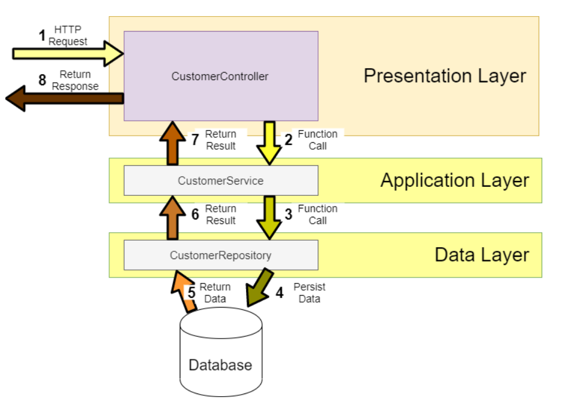

# BANKING APPLICATION - Spring Boot REST API tutorials documentation

## This is a simple REST API that does basic crud operations.

### Business features

<details>
<summary>Click to expand</summary><br>
  <ol>
    <li>Fetch all customers with pagination</li>
    <li>Get customer by account</li>
    <li>Search customers by field name, with pagination</li>
    <li>Create account for customers</li>
    <li>Update customers by account number</li>
    <li>Delete customer by account number</li>
    <li>Transfer credit from one acc number to another</li>
  </ol>

</details>

### Technical features

<details>
<summary>Click to expand</summary><br>
  <ol>
    <li>Customize json property<br>

The Jackson JSON toolkit contains a set of Java annotations which you can use to influence how JSON is read into objects, or what JSON is generated from the objects. Click [HERE](http://tutorials.jenkov.com/java-json/jackson-annotations.html) for more information.
<br>

  </li>
    <li>Creation timestamp<br></li>

Marks a property as the creation timestamp of the containing entity. The property value will be set to the current VM date exactly once when saving the owning entity for the first time.

```
@CreationTimestamp
private Date createdAt;
```
  
 <li>Validations</li>

We assume that this is web-service where user can enter any field and value so a lot of validation is needed. Although most of the time validation will be done in front-end.

  </ol>
</details>

### Diagram flow

<details>
<summary>Click to expand</summary><br>

```
Database
    |
Repository -> Model (Entity)
    |
Service - > Exception Handler
    |
Controller (Handle request from external)
```

</details>

### Run DB server

<details>
<summary>Click to expand</summary><br>

We will create DB without having to manually create from RDBMS by utilising Spring JPA. Our table will look something like this:

  <ul>
    <li>We will create DB without having to manually create from RDBMS by utilising Spring JPA. Our table will look something like this:</li>

[](https://ipwithease.com/three-tier-architecture-in-application/)

  <li>We will be using MySql for database creation and will be using Docker to run MySql. Lets create an instance of MySql Docker image:</li>

```
docker run --detach --env MYSQL_ROOT_PASSWORD=root --env MYSQL_DATABASE=mydb --env MYSQL_PASSWORD=root --env MYSQL_USER=admin --name localhost --publish 3306:3306 mysql:8.0

docker run --name postgres-tutorial -e POSTGRES_PASSWORD=password -d -p 5432:5432 postgres
```

  </ul>
</details>

### Verify database

<details>
<summary>Click to expand</summary><br>

Once Spring starts, let's check our database (thru docker container) to verify if table is created and data added. Make sure the parameters entered is consistent with the variables used during docker creation.

  <ul>
  <li>Run mysql in cli using docker</li>

```
docker exec -it localhost bash
```

  <li>Connect to mysql</li>

```
mysql -u admin -proot;
```

  <li>Test</li>

```
use mydb;
show tables;
desc customer;
select * from customer;
```

  <li>Stop & remove all running proceses</li>

```
docker rm $(docker ps -a -q) -f
```

  </ul>
</details>

### Global exception - @ControllerAdvice

<details>
<summary>Click to expand</summary><br>
  <ul>
  <li>Intro</li>

During the software development process, it is inevitable to handle all kinds of exceptions. For me, at least half of the time is spent dealing with all kinds of exceptions, so there will be a lot of try {...} catch {...} finally {...} code blocks in the code, which not only has a lot of redundant code, but also affects the readability of the code.

  <li>So what is it?</li>

Spring consider exception handling a cross-cutting concern, thus it allows you to handle exceptions separately from the rest of your code. This approach truly does work great with Spring!

Used for global error handling in the Spring MVC application.It also has full control over the body of the response and the status code.

  <li>Types</li>

There are 2 types: <br>

  <ol>
  <li>Custom exception</li>

Where u throw yourself if it meets your condition and use GlobalExceptionHandler to handle [HERE](https://stackoverflow.com/questions/67090406/throw-custom-exception-with-spring-data-rest)

  <li>Global exception</li>

Where it throws itself and u handle it using GlobalExceptionHandler
  </ol>

  <li>Benefits</li>
No cluttering of your code surrounding with try-catch blocks. This will result in cleaner and manageable code. You can have more meaningful error message
        
</ul>
</details>

### Unit Testing

<details>
<summary>Click to expand</summary><br>

<ul>
  <li>Introduction</li><br>

Unit test refers to the test of the most basic parts of an app -> A Unit. For REST application, we create test cases starting from Repository layer, then Service layer, then Controller where the test focus on integrating different layers of the application.

  <li>Code Coverage</li><br>

Code coverage describes the percentage of code covered by automated tests. in Eclipse we use [EclEmma](https://www.eclemma.org/) which is a free Java code coverage tool for Eclipse. Coverage is measured by percentage. Especially when working in enterprise, we must achieve atleast 50% total coverage


To achieve a high % coverage, we need to test elements that has highest number of instruction. Also, to cover your service class is highest priority.

  <li>Code quality</li><br>

[(SonarLint)](https://www.sonarlint.org/) is a Free and Open Source IDE extension that identifies and helps you fix quality and security issues as you code. Like a spell checker, SonarLint squiggles flaws and provides real-time feedback and clear remediation guidance to deliver clean code from the get-go.

  <li>Create test case</li><br>

If you are using IntelliJ, simply right-click on the repo file -> new -> Junit. This will automatically generate test method. We will implement our test cases.

</ul>

</details>

### Unit Test - Repository

<details>
<summary>Click to expand</summary><br>

In Repository, we dont need to test build-in methods of JPA. Only test your custom methods. Since we dont have one, lets create one (using @Query). This query will count number of country in employee table. The result will have custom fields (using projection)

  <ul>
    <li>Diagram</li>

[](https://ipwithease.com/three-tier-architecture-in-application/)

 <li>H2 database</li><br>

To test repository, we can run the query against H2 database simply we dont want to store the data during testing. This can be easily done by copy-paste our main application.properties into the test folder and change the db url from mysql to h2. Schema and data will be loaded from the main resources

  </ul>
</details>

### Unit Test - Service layer

<details>
<summary>Click to expand</summary><br>

Hardest unit to test.

  <ul>
    <li>Using Mock</li><br>

Since our repo is tested and works fine, we dont need to test the service class against repo but instead we will mock it. Basically we don't want to test the real repository when we are testing the service because we know that repository is tested and it works. So we can just mock its implementation inside of the service test.
The benefit that we get is that our unit test is now testing is fast as we don't have to bring up the database, create table, insert a new student, drop the database, and all of that stuff that you've seen when we tested the repository which we've done earlier. Therefore anywhere that we use the repository we just `mock` it.

[](https://www.tutorialspoint.com/mockito/mockito_junit_integration.htm)

Besides mocking the repository, we can mock basically anything and define what it reutrn, making our work easier and faster [(more info)](https://visitmehere.wordpress.com/2019/06/07/mock-an-arraylist/). We also implement @InjectMocks simply because Service layer need Repository layer [(more info)](https://stackoverflow.com/questions/16467685/difference-between-mock-and-injectmocks).

  <li>Important</li><br>

You dont need to create any real objects at all. Just create mock of any instance, method, class, anything. The goal of testing the service is to detach any real object as much as possible!

  </ul>
</details>

### Unit Test - Controller layer

<details>
<summary>Click to expand</summary><br>

Unlike the Service layer where we can mock everything, here we need to use real object for the response. From there we will use JSONPath to match certain fields in your result set. If you are not familiar with it, you can use [(JSONPath Online Evaluator)](https://jsonpath.com/) to play around with the expressions.

</details>

### Postman collections

<details>
<summary>Click to expand</summary><br>

[View collection](./src/main/resources/banking-rest-api-tutorials.postman_collection.json)

</details>

### Sample

<details>
<summary>Click to expand</summary><br>
  <ul>
    <li>Fetch all customers with pagination</li>
  </ul>
</details>

### Useful resources

<details>
<summary>Click to expand</summary><br>
 
[How to map random fields](https://newbedev.com/spring-rest-partial-update-with-patch-method)  
[Javax validation](https://www.baeldung.com/javax-validation)  
[Retrieve validation message](https://stackoverflow.com/questions/2751603/how-to-get-error-text-in-controller-from-bindingresult)  
[Diff btwn javax.persistence & javax.validation and how to handle error from each validation](https://reflectoring.io/bean-validation-with-spring-boot/)  
[Create mock data](https://www.mockaroo.com/)  
[How to validate patch method using ValidatorFactory](https://stackoverflow.com/questions/56139024/how-to-automatically-add-bean-validation-when-partially-updating-patch-spring-bo)  
[Structuring Your Code](https://docs.spring.io/spring-boot/docs/current/reference/html/using.html#using.structuring-your-code)  
[If you have issue packaging to jar](https://stackoverflow.com/questions/35394885/lombok-not-compiling-in-maven)  
[Custom fields using projection](https://stackoverflow.com/questions/46083329/no-converter-found-capable-of-converting-from-type-to-type)

</details>

### For recap

<details>
<summary>Click to expand</summary><br>
 <ul>
  <li>Know that entity having camelCase will mapped into db into under_score eg: </li>

```
birthDate -> birth_date in Database
```

  <li>Arrange your order of json properties. Currently the id is at the bottom. we can bring this up by adding this at class level: </li>
 
```
@JsonPropertyOrder({"firstName","lastName"})
```
From this example, firstName will be at the most top followed by lastName
  <li>Hide json property. You can hide certain property of json. let us hide lastName by this annotation in entity:</li>

```
@JsonIgnore
private String lastName;
```

  <li> Rename json property. You can rename your json property name instead of using the default value based on variable name</li>

```
@JsonProperty("MyAwesomeFirstName")
private String firstName;
```

  <li>Use exception to throw validation error by means of try-catch</li>
  <li>Implement more fields in Employee to learn pagination</li>
   
  <li>In Repository, we dont need to test build-in methods of JPA. Only test your custom methods</li>

  <li>Entity</li>

Entities in JPA are nothing but POJOs representing data that can be persisted to the database. An entity represents a table stored in a database. Every instance of an entity represents a row in the table. This will be in Employee.java

  <li>Prepopulate data</li>

We can add values in our table in data.sql in resources folder. This values will be added when Spring starts. In certain scenario you might not able able to populate thru this approach so you have to manually add values thru test cases.

This test case will be created under repository test folder, for the sake of Project Structure Best Practices. But first we need to create repository, then generate test case through it, run Spring, then run this test.

[(Explanation)](https://youtu.be/Geq60OVyBPg?t=2422)

 <li>Create native query</li>

[Click here](https://stackoverflow.com/questions/58453768/variables-in-spring-data-jpa-native-query)

 <li>3 tier architecture</li>

[](https://ipwithease.com/three-tier-architecture-in-application/)

 <li>Layered Architecture</li>

[](https://medium.com/java-vault/layered-architecture-b2f4ebe8d587)

  </ul>
</details>
